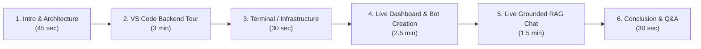

# Complete Video Walkthrough & Presentation Script: Embeddable RAG Chatbot Platform

This guide provides a step-by-step presentation roadmap for recording your live demo video for your instructor. It covers **where to start, what to show in VS Code, what to say, and how to perform the live demo from login to bot creation, crawling, auto-branding, and grounded chat.**

---

## Quick Reference: Video Structure & Timing (~7–9 Minutes)



| Section | Target Duration | Screen / Window | Core Objective |
| :--- | :--- | :--- | :--- |
| **Part 1: Introduction** | 0:00 – 0:45 | Dashboard or Architecture Diagram | Pitch the problem, solution, and core tech stack |
| **Part 2: VS Code Backend Code** | 0:45 – 3:45 | VS Code editor | Walk through 6 core architectural modules in sequence |
| **Part 3: Infrastructure Setup** | 3:45 – 4:15 | Terminal / Docker | Show PostgreSQL + `pgvector`, Uvicorn, and background workers |
| **Part 4: Live Dashboard Demo** | 4:15 – 6:45 | Browser (`http://localhost:8000/dashboard`) | Login, create new bot, live crawl & indexing, auto-branding |
| **Part 5: Live RAG Chat & Grounding** | 6:45 – 8:15 | Browser (`/widget/chat` or Demo page) | Chat with bot, citations, off-topic rejection, streaming |
| **Part 6: Conclusion** | 8:15 – 8:45 | Camera / Summary slide | Recap multi-tenancy, security, and wrap up |

---

## Pre-Recording Checklist (Do This Before Clicking "Record")

1. **Start Docker**:
   ```bash
   docker start rag_postgres
   ```
2. **Start Backend Server**:
   ```powershell
   cd backend
   .\.venv\Scripts\python.exe -m uvicorn app.main:app --port 8000 --host 0.0.0.0
   ```
3. **Open VS Code with these files pinned in tabs**:
   - `backend/app/db/models/knowledge.py` (pgvector column)
   - `backend/app/crawler/validator.py` (SSRF defenses)
   - `backend/app/extraction/extractor.py` (text, contact & brand extraction)
   - `backend/app/crawler/crawler.py` (HTTP static + Playwright dynamic fallback)
   - `backend/app/tasks/crawl_tasks.py` (1-pixel canvas color detection & auto-enrichment)
   - `backend/app/chat/service.py` & `backend/app/rag/prompt.py` (anti-prompt injection RAG)
   - `backend/static/widget.js` (sandboxed embeddable iframe)
4. **Open Browser at `http://localhost:8000/dashboard`** in a clean window.
5. **Have a target website ready to crawl** (e.g. `https://www.bytetuned.com/`, `https://farazthewebguy.com/`, or `https://www.cyberify.co/`).

---

## Part 1: High-Level Introduction (0:00 – 0:45)

### What to Show on Screen
Display the **Dashboard** or the Mermaid Architecture diagram from `walkthrough.md`.

### What to Say (Spoken Script)
> *"Hello everyone and welcome! Today I am presenting my end-to-end **Embeddable Website-Specific RAG Chatbot Platform**.*  
> 
> *The problem we are solving is simple: website owners want an intelligent AI assistant on their site, but traditional chatbots either hallucinate or require painful manual configuration of FAQs.  
> 
> *Our platform solves this completely. A business owner simply enters their website URL. Our system safely crawls the website, cleans the text, embeds it into **PostgreSQL with pgvector**, automatically extracts the company's real brand color and logo, and provides a single `<script>` tag to embed a sandboxed AI chat widget.  
> 
> *Let's first take a quick look under the hood at the backend architecture in VS Code, and then perform a live demonstration."*

---

## Part 2: VS Code Backend Code Walkthrough (0:45 – 3:45)

Open VS Code and navigate through these files in order:

### 1. Multi-Tenant Schema & pgvector (`backend/app/db/models/knowledge.py` & `bot.py`)
- **Show on Screen**: Lines where `Chunk` model has `embedding = mapped_column(Vector(384))` and `bot_id = mapped_column(ForeignKey("bots.id"))`.
- **What to Say**:
  > *"Starting with the database layer: We use PostgreSQL 16 with the `pgvector` extension.  
  > In `knowledge.py`, every chunk of text has a 384-dimensional vector embedding column. Notice that every single model—whether it is a Bot, Page, Chunk, or Conversation—is strictly scoped by `bot_id`. This guarantees 100% multi-tenant isolation, meaning Tenant A can never retrieve Tenant B's data."*

### 2. SSRF Protection (`backend/app/crawler/validator.py` & `ssrf.py`)
- **Show on Screen**: The IP validation logic blocking loopbacks, private ranges, and metadata IPs (`169.254.169.254`).
- **What to Say**:
  > *"Because our crawler takes arbitrary user-submitted URLs, security is critical. In `validator.py`, we implement deep SSRF protection. Before any network request is made, we resolve the domain via DNS and block any loopbacks, internal private subnets like 192.168 or 10.0, and cloud metadata endpoints like AWS/GCP `169.254.169.254`. This prevents malicious users from scanning internal infrastructure."*

### 3. Web Crawler with Headless Browser Fallback (`backend/app/crawler/crawler.py`)
- **Show on Screen**: `fetch_static` with `httpx` and `fetch_dynamic` with `Playwright`.
- **What to Say**:
  > *"Next is the crawler in `crawler.py`. It uses a dual-engine architecture:  
  > 1. It first attempts fast, static HTTP fetching with modern browser headers.  
  > 2. If it detects a single-page React/Next.js application or client-side rendering, it automatically falls back to headless Chromium using Playwright to render the JavaScript DOM.  
  > It performs BFS link traversal bounded by depth and safety limits."*

### 4. Content Extractor & Brand Identity Engine (`extractor.py` & `crawl_tasks.py`)
- **Show on Screen**: `ContentExtractor.extract`, `extract_dominant_color_from_image`, and `detect_live_cta_color`.
- **What to Say**:
  > *"In `extractor.py`, we strip boilerplate like scripts, ads, and cookie banners, while intelligently preserving footers, contact information, and physical addresses.  
  > Crucially, we handle **modern lazy loading**: WordPress and Elementor use 1x1 base64 SVG placeholders in `src`, while the real image is in `data-src` or `srcset`. Our extractor automatically unpacks these attributes and rejects transparent placeholders so the true high-res logo is always captured.  
  > In `crawl_tasks.py`, we built an **Automated Branding Engine**. It analyzes the brand logo image using Pillow to extract authentic dominant colors (like NMSoft's `#975AEA` purple), while filtering out third-party contact widgets like floating WhatsApp buttons or social greens. It also cleans the company name and sets up the widget identity automatically."*

### 5. Vector Indexing & Grounded RAG (`knowledge/indexing.py` & `chat/service.py`)
- **Show on Screen**: `FastEmbed` embedding generation and `RAGPromptBuilder` in `prompt.py`.
- **What to Say**:
  > *"Once pages are extracted, `indexing.py` chunks the content semantically and generates vector embeddings locally using `FastEmbed` (BAAI/bge-small-en-v1.5) with zero external API fees.  
  > When a visitor asks a question, `chat/service.py` performs cosine vector retrieval in pgvector strictly filtered by `bot_id`. It wraps retrieved context in anti-prompt-injection quarantine tags `<untrusted_website_reference_data>` and queries our Groq LPU LLM (`openai/gpt-oss-120b`), generating grounded answers with verified source citations."*

### 6. Sandboxed Embed Widget (`backend/static/widget.js`)
- **Show on Screen**: The `iframe` creation and postMessage communication.
- **What to Say**:
  > *"Finally, in `widget.js`, the chatbot is injected into host websites via an isolated `<iframe>`. This ensures the chatbot's styles never clash with host site CSS, providing complete style isolation."*

---

## Part 3: Terminal & Infrastructure Verification (3:45 – 4:15)

### What to Show on Screen
Split terminal or PowerShell windows showing the active services.

### What to Say (Spoken Script)
> *"Here in the terminal, our stack is running:  
> - Docker container `rag_postgres` running PostgreSQL 16 with `pgvector`.  
> - Our FastAPI backend running on Uvicorn on port 8000.  
> - Background worker tasks executing ingestion and indexing.  
> Now let's switch to the browser and see this working live in action."*

---

## Part 4: Live Dashboard Demo (4:15 – 6:45)

Open your browser to `http://localhost:8000/dashboard`.

### Step 1: Authentication
- **Action**: Sign in or create a test account (e.g. `awais@gmail.com`).
- **What to Say**:
  > *"Here is the operator dashboard. It uses a fixed, modern dark theme (`#080A0D` / `#D6A84F`). Notice that our session is authenticated with cryptographically signed JWT tokens."*

### Step 2: Create a New Chatbot
- **Action**: Click the **"+ New Bot"** button in the top right.
  - Bot Name: `NMSoft Chatbot` (or `ByteTuned Chatbot`)
  - Website URL: `https://nmsofttechnologies.com/` (or `https://www.bytetuned.com/`)
  - Click **"Create & Ingest"**.
- **What to Say**:
  > *"I will create a brand new chatbot by entering the website URL. When I submit, the backend automatically registers the bot and kicks off the asynchronous crawl pipeline."*

### Step 3: Real-Time Crawling & Vector Indexing
- **Action**: Point to the status banner and counters updating live on the screen.
- **What to Say**:
  > *"Notice how the dashboard updates live without refreshing:  
  > 1. First, **Active Crawl in Progress**: our 5-worker concurrent crawler fetches pages in parallel—crawling 26 to 34 pages in under 9 seconds!  
  > 2. Second, **Knowledge Indexing in Progress**: the crawl completes, and FastEmbed begins semantic chunking and embedding vectors into pgvector.  
  > 3. And in seconds, the badge flips to green **READY**, and Indexing Status confirms **'Indexed in pgvector'**!  
  > 
  > We can click the 'Crawled Pages' tab to see every single indexed URL and content preview, and the 'Canonical Knowledge' tab to inspect the generated unified `website.md` markdown document."*

### Step 4: Show Automated Branding Detection
- **Action**: Click the **"Branding Customizer"** tab in the sidebar.
- **What to Say**:
  > *"Look at this screen: I didn't type a single color or upload a file.  
  > Our automated branding engine detected:  
  > - The clean company name: **NMSoft Technologies**  
  > - The authentic brand primary color: **#975AEA (NMSoft Purple)**  
  > - The official logo URL: **cropped-Untitled-design-3.png**  
  > 
  > And over on the right, the live preview renders the customer-facing chat widget in NMSoft's exact purple color scheme with the official logo avatar displayed."*

### Step 5: Show Embed Code Snippet
- **Action**: Click the **"Embed Code"** tab in the sidebar.
- **What to Say**:
  > *"Under Embed Code, the platform generates a one-line `<script>` tag containing the bot's unique ID. Any customer can paste this on their Shopify, WordPress, or custom site and the bot is immediately live."*

---

## Part 5: Live Grounded RAG Chat (6:45 – 8:15)

Open the chat widget or navigate to `http://localhost:8000/widget/chat?bot_id=...&api_host=http://localhost:8000`.

### Test Query 1: Core Offering & Services
- **Action**: Type: *"What services does NMSoft Technologies offer and where are you located?"*
- **What to Say**:
  > *"Let's ask the bot what NMSoft offers and where they are located.  
  > Notice the rapid response streamed by Groq. The answer states clearly: NMSoft offers Digital Marketing, SEO, Custom WordPress Development, E-commerce, and SEM.  
  > And notice the location: it correctly extracted **Multan, Pakistan**!  
  > Below the response, look at the clickable source citations linking directly to the exact crawled pages on the website."*

### Test Query 2: Strict Grounding & Anti-Hallucination Test
- **Action**: Type: *"What is the recipe for a chocolate cake?"*
- **What to Say**:
  > *"Now, let's test strict grounding by asking something completely outside the website: 'What is the recipe for a chocolate cake?'  
  > Look at that: The bot politely responds that it can only answer questions grounded in NMSoft Technologies' website. It does NOT hallucinate or entertain off-topic queries. This proves our prompt injection boundaries and grounding mandates are working effectively."*

---

## Part 6: Wrap-Up & Conclusion (8:15 – 8:45)

### What to Show on Screen
Switch to the dashboard overview showing multiple ready bots:
- **Faraz The Web Guy**: `#1C518D` (Royal Navy)
- **Cyberify**: `#FF6900` (Cyberify Orange)
- **ByteTuned**: `#F96714` (ByteTuned Orange)
- **NMSoft Technologies**: `#975AEA` (NMSoft Purple)

### What to Say (Spoken Script)
> *"To summarize what we've built:  
> - A high-throughput concurrent crawler with dynamic Playwright fallback.  
> - SSRF-hardened network boundaries.  
> - Local, privacy-preserving FastEmbed vector embeddings stored in PostgreSQL with pgvector.  
> - An intelligent logo and canvas color detector that auto-brands the widget for every unique website.  
> - Low-latency grounded RAG with Groq 120B and anti-hallucination guardrails.  
> - A drop-in `<script>` widget that isolates styles via sandboxed iframes.  
> 
> Thank you for your time, and I am ready for any questions!"*

---

## Pro-Tips to Impress Your Instructor

1. **Highlight the Invariants**:
   - Whenever you mention data, use the term **"strict multi-tenant isolation scoped by bot_id"**.
   - Whenever you mention vector search, mention **"cosine distance indexed in PostgreSQL pgvector"**.
2. **Explain the Lazy-Loading Logo & Canvas Color Techniques**:
   - Explain how WordPress/Elementor lazy-loading was handled by unpacking `data-src` and `srcset` instead of accepting 1x1 base64 placeholders.
   - Explain how third-party floating buttons (like WhatsApp green) are excluded in favor of authentic logo and heading colors.
3. **Show Multiple Bots**:
   - Point out that Faraz is Royal Blue `#1C518D`, ByteTuned is Orange `#F96714`, Cyberify is `#FF6900`, and NMSoft is Purple `#975AEA`. This visually demonstrates that the multi-tenant branding engine is truly universal and dynamic.

